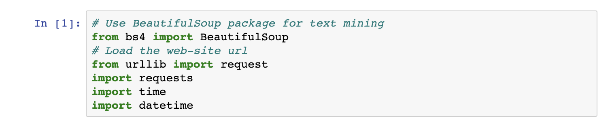
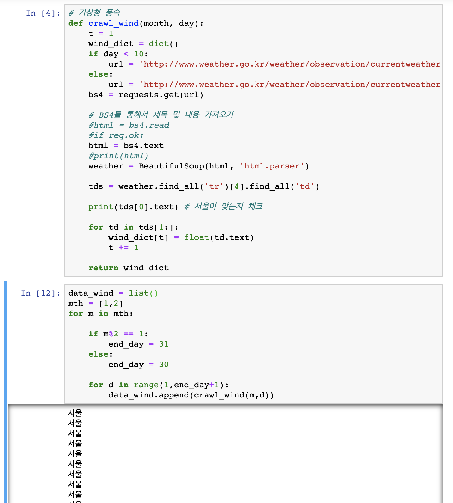
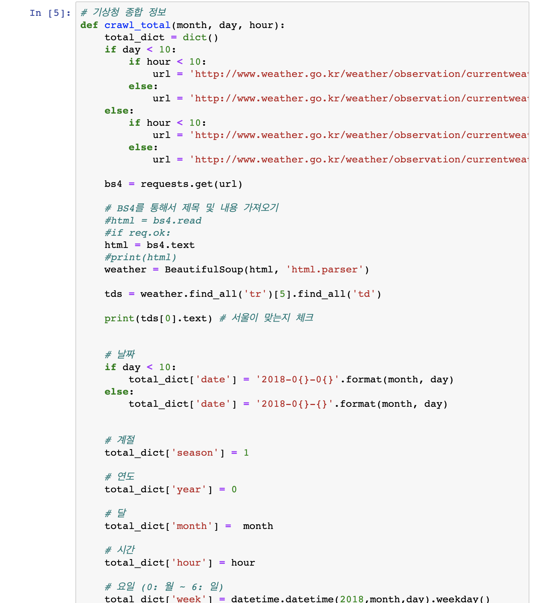
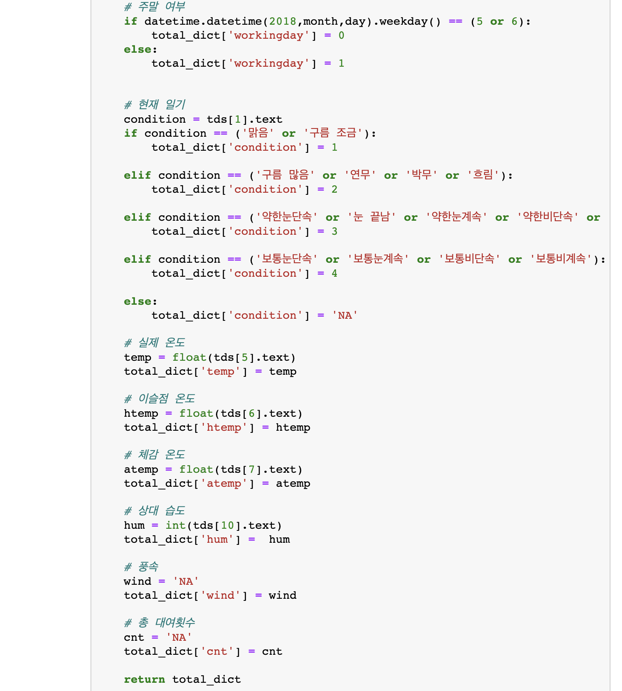
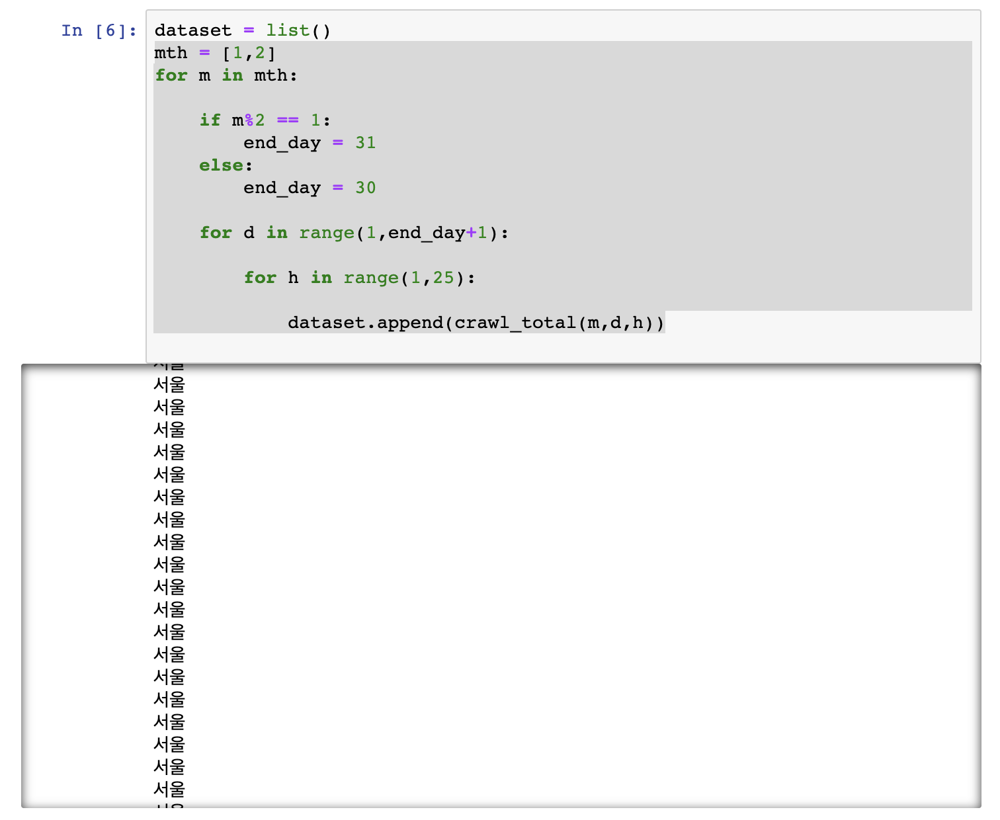
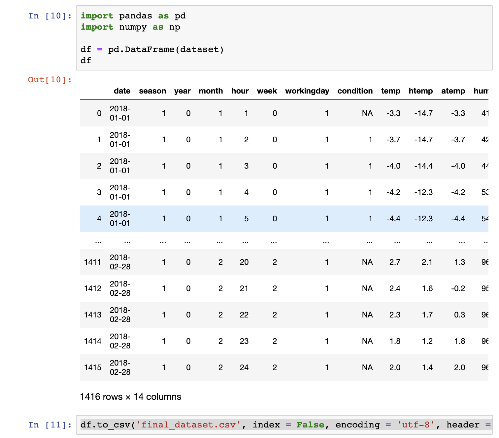
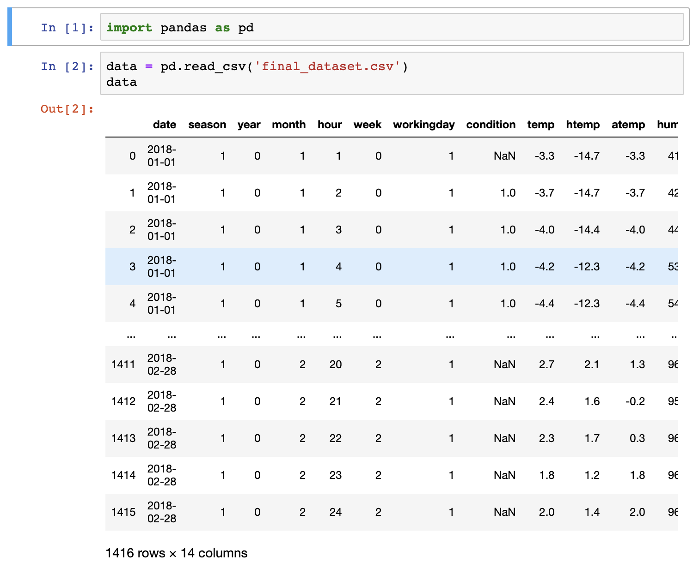
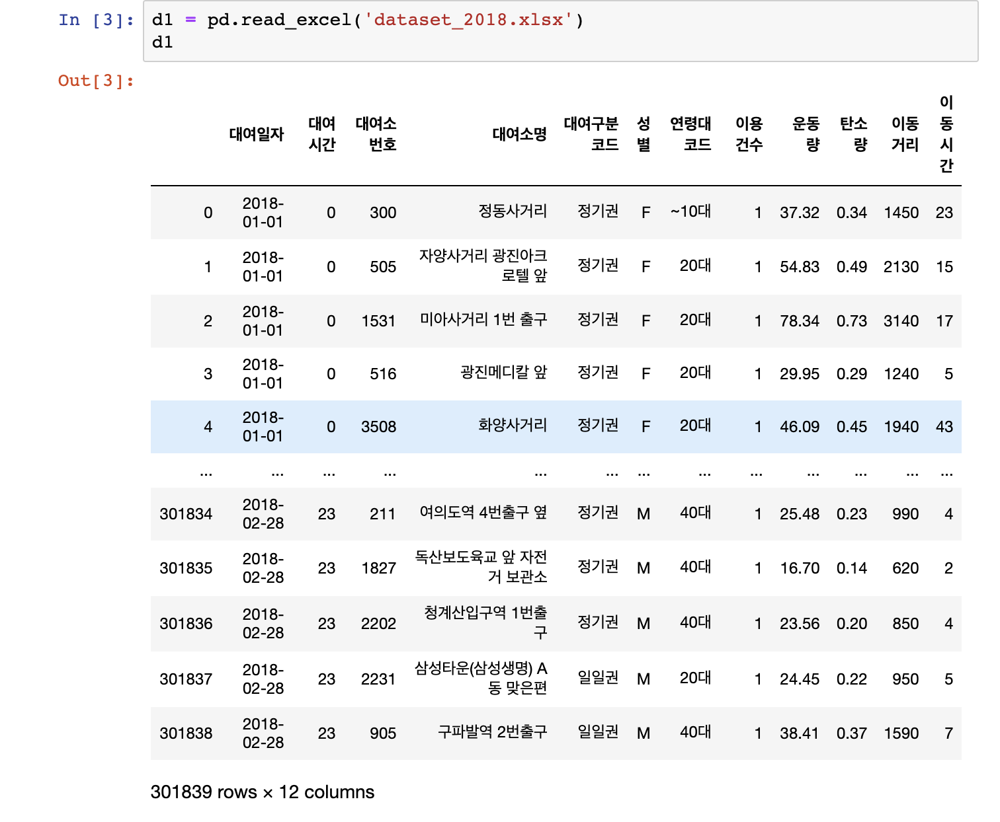
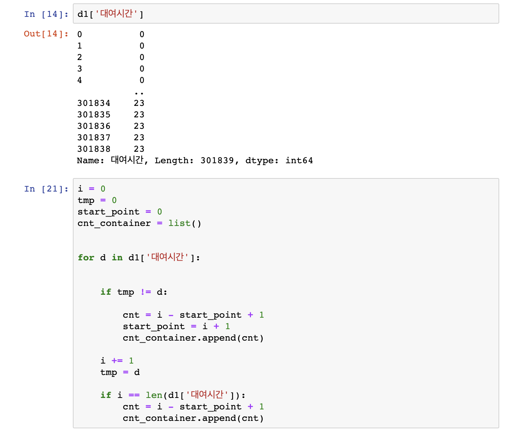
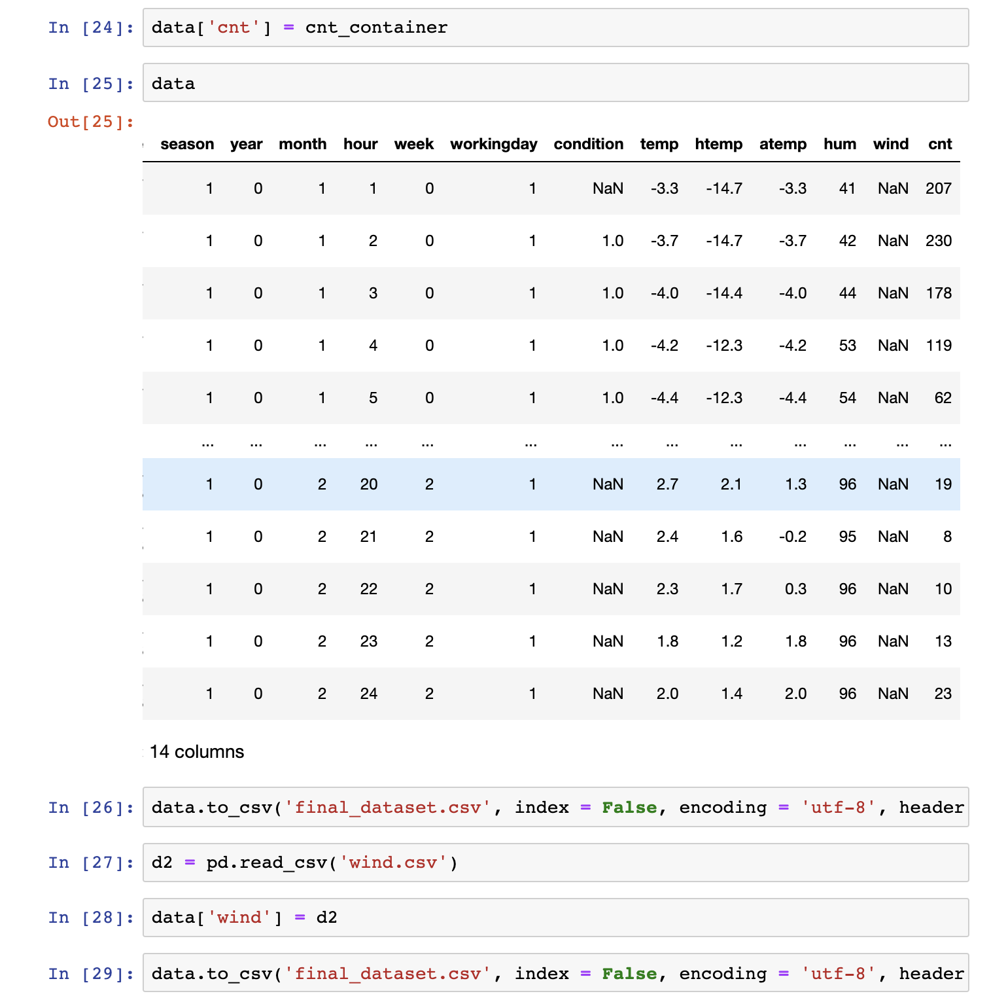

# 서울시 시간대별 자전거 대여 횟수 예측하기 

## 1장. 서론

### 1.1 필요 패키지 불러오기 및 최초 설정

---
```{r load_package}
rm(list=ls())
options(width=300, scipen=999)
suppressPackageStartupMessages({
library(tidyverse)
library(readxl)
library(writexl)
library(caret)
library(reshape)
library(pROC)  
library(ROCR)
library(ggplot2)
library(gridExtra)
library(ggrepel)
library(ggExtra)
library(knitr)
knitr::opts_chunk$set(comment=NA,    echo = TRUE,     message=TRUE,
   error=FALSE,   hightlight=TRUE, include=TRUE, prompt=TRUE, warning=FALSE,  fig.width=7, fig.height=7)
})

setwd('/Users/jaehyungseo/Desktop/SJH542_final(bicycle)/')
source('/Users/jaehyungseo/Desktop/SJH542_final(bicycle)/source_dataMining.R')

```

### 1.2 참고 데이터 소스

---

#### A. 2011년 ~ 2012년도 미국 워싱턴 DC 자전거 공공데이터 

- Fanaee-T, Hadi, and Gama, Joao, "Event labeling combining ensemble detectors and background knowledge", Progress in Artificial Intelligence (2013): pp. 1-15, Springer Berlin Heidelberg,

  http://capitalbikeshare.com/system-data

#### B, 서울열린데이터 광장 > 서울특별시 공공자전거 이용정보(시간대별)

 - 서울특별시 공공자전거 시간대별 대여정보_201801_02.xlsx
 - 시간대별 총 대여횟수 

    https://data.seoul.go.kr/dataList/datasetView.do?infId=OA-15245&srvType=F&serviceKind=1&currentPageNo=1

#### C. 기상청 날씨누리 > 관측자료 > 도시별 현재날씨 

- 종합 정보, 서울, 2018.01.01 ~ 2018.02.28
- 현재 일기, 현재 기온, 이슬점 온도, 체감 온도, 습도, 풍속

  http://www.weather.go.kr/weather/observation/currentweather.jsp

---

### 1.3 수집한 데이터 정보

---

#### B. 서울특별시 공공자전거 시간대별 대여정보_201801_02.xlsx

```{r load_data}
bicycle_data <- read_xlsx("/Users/jaehyungseo/Desktop/SJH542_final(bicycle)/dataset/SJH542_(bicycle)org.xlsx")
dim(bicycle_data)
```

#### C. 기상청 시간대별 일기 정보 + 시간대별 대여 정보

```{r load_data2}
data <- read_csv('/Users/jaehyungseo/Desktop/SJH542_final(bicycle)/dataset/SJH542_(bicycle)d.csv')

dim(data)
str(data)
```

---

### 1.4 데이터 수집 과정

** 데이터 수집은 Python 코드를 활용해서 직접 수집했습니다.

#### A. 패키지 불러오기 및 크롤링 함수 정의

    파일명 변경
    * final_dataset.csv --> SJH542_(bicycle)d,csv
    * dataset_2018.xlsx --> SJH542_(bicycle)org.xlsx

---

#### (1) 데이터 수집에 필요한 패키지를 불러옵니다.

 

---

#### (2) 풍속 정보를 수집하기 위해 별도로 정의한 함수입니다.



--- 

#### (3) 풍속을 제외한 나머지 일기 정보를 수집하기 위해 정의한 함수입니다. part(1)



---

#### (4) 풍속을 제외한 나머지 일기 정보를 수집하기 위해 정의한 함수입니다. part(2)



---

#### B. 데이터 크롤링을 통한 데이터 수집 진행

---

#### (1) 데이터 수집을 진행합니다.



---

#### (2) 수집한 데이터를 저장합니다.



---

### 1.5 데이터 설명

    수집한 데이터는 2가지로 나누어져 있으며, 수집을 위해 어떠한 변수들을 모아야 하는지 확인하기 위한 데이터가 별도로 존재합니다.
 
    참고 데이터는 2011년 ~ 2012년 워싱턴, 자전거 대여 횟수 예측 모델에서 사용했던 것입니다. 해당 데이터는 일기 정보와 시간 정보를 바탕으로 시간대 및 일자 별로 자전거를 얼마나 빌려가는지 예측하는데 활용되었습니다.
 
    첫번째로 수집한 데이터는 2018년 1월 ~ 2월 서울시의 시간대별 자전거 대여 총 횟수 정보를 담고 있습니다. 최초의 데이터는 자전거를 대여한 1명의 정보를 행으로 담고 있었습니다. 따라서 분석 목적에 맞게 해당 데이터에서 시간대별 총 대여횟수 'cnt'를 별도로 추출했습니다.
 
    두번째로 수집한 데이터는 2018년 1월 ~ 2월 서울시의 시간대별 일기 정보를 담고 있습니다. 시간대별로 별도로 저장한 데이터셋이 없어서 직접 Python의 BeautifulSoup 패키지를 활용한 웹 크롤링을 통해 필요한 정보를 수집했습니다. 여기서 크롤링한 정보는 다음과 같습니다.
  
  * 'month' 월
  * 'hour' 시간
  * 'condition' 종합 일기 (맑음, 흐림, 강수량, 적설량 등)
  * 'temp' 온도
  * 'htemp' 이슬점 온도
  * 'atemp' 체감온도
  * 'hum' 습도
  * 'wind' 풍속

---

### 1.6 분석 목적

    참고 데이터의 경우, 국내의 데이터가 아닌 미국 워싱턴의 자료를 바탕으로 제작되었습니다. 그러나, 국가와 공간적 환경이 다른 데이터를 바탕으로 학습된 모델이 국내 상황에 적합한 예측을 할 것이라 생각하지 않습니다.
 
    따라서, 참고 데이터에서 활용했던 변수들을 참고하여 직접 분산되어 있는 데이터를 수집하여 하나의 데이터셋으로 제작했습니다. 이 과정에서 불필요해 보이는 특정 변수는 제거하고 활용 가능해 보이는 새로운 변수는 추가했습니다. 
 
    국내 데이터를 기반으로 학습된 모델은 최근 서울시와 국내 스타트업 차원에서 진행하고 있는 공유 자전거 사업에 기여할 수 있을 것이라 기대하고 있습니다.
 
    해당 사업 분야에서 필수적으로 수반되는 '자전거 재수거 및 재충전' 과정에서 발생하는 비용을 크게 줄일 수 있습니다.특정 시간대와 기상 상황에 따라서 자전거 수요를 예측함으로써 효율적으로 자전거 배치와 수거 운용이 가능하며, 비효율적인 시간 배치로 인한 인력 자원 낭비와 자전거 부족으로 인한 고객 이탈 현상을 방지할 수 있습니다. 

---

## 2장. Codebook

### 2.1 데이터 클렌징

    데이터를 수집하는 과정에 해당 데이터를 병합 및 재구성하면서 일부 데이터가 삭제되고 특정 변수만 선택하면서 사전 클렌징 작업이 Python 코드로 진행되었습니다. 
  
#### 수집한 데이터 합치기

(시간대별 종합 일기 정보 + 시간대별 풍속 + 시간대별 총 대여 수)

    파일명 변경
    * final_dataset.csv --> SJH542_(bicycle)d,csv
    * dataset_2018.xlsx --> SJH542_(bicycle)org.xlsx

---

#### (1) 시간대별 종합 일기 정보를 불러옵니다.



---

#### (2) 시간대별 총 자전거 대여 수를 불러옵니다.



---

#### (3) 위 두개의 데이터를 합칩니다.



---


#### (4) 풍속 정보까지 합쳐서 저장합니다.



    최종 데이터셋으로 재구성된 데이터는 학습을 위해, NA를 포함한 열과 학습에 불필요한 열은 제거했습니다. 또한 수치 값의 통일을 위해 일기 정보에 대해 [0 ~ 1] 사이의 정규화를 진행했습니다.
  
---

#### A. 정규화 이전, NA열 제외와 일기 정보만 추출하기 

```{r bf_norm}

Y <- data[, 14] # Class variable
data_rv <- data[,c(9:13)] # numeric variables
head(data_rv)

```

#### B. 정규화 이후, [0~1]의 수치로 정규화 하기

```{r af_norm}

data_rv <- transform(data_rv,
                     temp = (temp - min(temp))/ (max(temp) - min(temp)),
                     htemp = (htemp - min(htemp))/ (max(htemp) - min(htemp)),
                     atemp = (atemp - min(atemp))/ (max(atemp) - min(atemp)),
                     hum = (hum - min(hum))/ (max(hum) - min(hum)),
                     wind = (wind - min(wind))/ (max(wind) - min(wind))
                     )

head(data_rv)

```

#### C. 시간대 및 요일 정보를 포함시키기

```{r add_time}

X <- cbind(data[, c(5:6)], data_rv)

```

---

### 2.2 변수 설명

```{r, result='asis'}

knitr::kable(read_csv('/Users/jaehyungseo/Desktop/SJH542_final(bicycle)/dataset/naive_codebook.csv'))

```

---

## 3장. Descriptive Analytics

    수집한 데이터에 대한 시각화를 진행해보았습니다. ggplot2를 사용하여, 시간대별 총 대여 횟수와과 일기 정보와의 관계를 살펴볼 수 있습니다. 
  
```{r plot1}

myM <- data.frame(X,Y)

my_data <- myM

#my_data_arranged <- my_data %>% arrange(cnt)

# G <- ggplot(data = my_data_arranged, aes(y = cnt))

G1 <- ggplot(data = my_data, aes(x = temp, y = cnt)) + geom_point() + labs(title = 'temp & rent per hour', y = 'rent bicycle per hour')
G2 <- ggplot(data = my_data, aes(x = atemp, y = cnt)) + geom_point() + labs(title = 'atemp & rent per hour', y = 'rent bicycle per hour')
G3 <- ggplot(data = my_data, aes(x = hum, y = cnt)) + geom_point() + labs(title = 'hum & rent per hour', y = 'rent bicycle per hour')
G4 <- ggplot(data = my_data, aes(x = wind, y = cnt)) + geom_point() + labs(title = 'wind & rent per hour', y = 'rent bicycle per hour')

grid.arrange(G1, G2, G3, G4,  nrow = 2)

```

    - 기온, 체감온도와 대여 횟수의 관계에서는 평균 온도를 중심으로 지나치게 높지 않은 기온 선에서 양의 상관관계를 보이고 있습니다.
    - 습도의 경우 평균 0.5보다 낮은 수준일 경우를 더 선호함을 알수 있으며, 풍속의 경우에도 평균 0.5보다 낮은 수준일 경우에 더 많은 사람들이 자전거를 대여함을 알 수 있습니다. 
    - 특히 습도와 풍속의 경우 평균보다 지나치게 높을 경우 급격하게 대여 횟수가 줄어듦을 알 수 있습니다.
    - 총 대여횟수는 평균 값 188, 중간값 212로, 시간 당 300대 이상 빌려가는 경우는 현저하게 적습니다. 

---
  
    마찬가지로 ggplot2를 활용하여, 시간대와 요일에 따른 총 대여횟수의 변화를 살펴보았습니다.

```{r, plot2}

my_data$hour <- as.factor(my_data$hour)

G_scatter1 <- ggplot(data = my_data,
             aes(x = hour, y = cnt)) + geom_point() + labs(title = 'rent per hour & hour', y = 'rent bicycle per hour')

G_scatter2 <- ggplot(data = my_data,
                    aes(x = week, y = cnt)) + geom_point() + labs(title = 'rent per hour & wind', y = 'rent bicycle per hour')


grid.arrange(G_scatter1, G_scatter2, nrow = 1)
```

    - 그래프의 산맥을 중심으로 데이터를 살펴보면, 오전 9시와 오후 7시에 해당하는 출퇴근 시간대에 평균보다 훨씬 높은 수치의 대여가 발생함을 알 수 있습니다. 해당 시간대에는 평소 배치해야 하는 수량에 2 ~ 3배에 해당하는 자전거를 배치해야 고객 이탈 비용을 줄일 수 있을 것으로 보입니다.

    - 그래프의 골짜기를 형성하고 있는 오전 6시와 오후 12시에는 사용량이 급격히 줄어들고 있습니다. 따라서 추후 급증하는 사용량에 대비하여 자전거 충전 및 재배치가 필요한 시점으로 보여집니다. 
 
    - 요일의 경우 현재 수집된 데이터 상으로 크게 차이를 보이고 있지 않습니다.
 
---
 
## 4장. Predictive Analytics

### 4.1 Preprocessing

```{r preprocessing}
nzv <- nearZeroVar(X, saveMetrics = TRUE)
nzv
```

    데이터 전처리 작업 이전에 우선 분산의 정도가 0으로 불량 데이터를 과도하게 포함한 열이 있는지 확인했습니다. 확인 결과 모두 FALSE로 별도의 제거 작업은 진행할 필요가 없었습니다. 

---

```{r num2ctg}

data$Y <- data$cnt
data$cnt <- NULL

Y <- data[,14]

myM <- data.frame(X,Y)

myM <- transform(myM, Y = cut(Y, breaks = c(0,100,200,300,500,1000),
                 include.lowest = TRUE,
                 right = TRUE,
                 labels = c("very low", "low", "moderate", "high", "very high")))

```

    Class Variable인 시간별 자전거 총 대여 횟수 'cnt' 부분을 데이터 분할을 위해 열 명 'Y'로 변경했습니다. 또한 myM 변수에 해당 데이터프레임을 할당하고, summary(Y)의 결과를 바탕으로 수치형 이산변수에 구간을 설정하여 레이블을 지정한 범주형 변수로 변경했습니다. 

* very low: 해당 시간대 자전거 대여횟수가 매우 적음.
* very high: 해당 시간대 자전거 대여횟수가 매우 많음. 

---

### 4.2 Data Splitting

```{r ds}
myM <- dataPartitionFUN(myM)

trData <- myM[[1]]
teData <- myM[[2]]
               
```

    데이터를 Train set 70%, Test set 30%로 할당하여 랜덤하게 셔플하여 훈련 및 검증할 수 있도록 분할합니다.
    (시드 값 123으로 설정되어있음)

---

### 4.3 Modeling 

    모델링은 caret 패키지의 Random Forest, R Partition, 그리고 Neural Network 세 가지 알고리즘을 활용했습니다. Random Forest의 경우, 샘플링 방식을 기본형, K-fold cross validation, 그리고 Repeated cross validation 세 가지 방법을 비교해서 훈련을 진행했습니다. 

#### Random Forest - Default

```{r rf}

model.rf <- caret::train(as.factor(Y) ~ ., method = "rf", data = trData) 
model.rf

```

    Random Forest, 기본 설정 값에 맞추어서 학습을 진행합니다.

---

#### Random Forest - K Fold Cross Validation

```{r rfk}

my_trControl1 <- trainControl(method = "cv", number = 5)
model.rf_k <- train(Y ~., method = 'rf', data = trData, trControl = my_trControl1)
model.rf_k

```

    Random Forest, K-Fold 샘플링 방식을 사용하여 학습을 진행합니다. 5분할 

---

#### Random Forest - Repeated Cross Validation

```{r rfcv}

my_trControl2 <- trainControl(method = 'repeatedcv',
                              number = 5,
                              repeats = 3)
model.rf_cv <- train(Y ~., method = 'rf', data = trData, trControl = my_trControl2)
model.rf_cv
```

    Random Forest, Repeated cross validation 샘플링 방식을 사용하여 학습을 진행합니다. 5분할 3회 반복

---

#### R partition - Repeated Cross Validation

```{r rp}

model.rp <- train(Y ~., data = trData, method = 'rpart',
                  trControl = my_trControl2)

```

    R Partition, Repeated cross validation 샘플링 방식을 사용하여 학습을 진행합니다. 5분할 3회 반복

---

#### Neural Network - Repeated Cross Validation

```{r nn}

model.nn <- train(Y ~., data = trData, method = 'nnet',
                  trControl = my_trControl2)

```


    Neural Network, Repeated cross validation 샘플링 방식을 사용하여 학습을 진행합니다. 5분할 3회 반복

---

### 4.4 Evaluation

    세 가지 알고리즘을 활용하여 학습을 진행하고, 각 모델에 맞추어 사전에 준비한 테스트 데이터를 바탕으로 ROC 그래프를 그리고 정확도를 바탕으로 검증을 진행합니다.

#### Eval: Random Forest - Repeated Cross Validation

```{r erf}

test.rf <- test_rocFUN(model.rf_cv, teData)
test.rf

```

---

#### Eval: R partition - Repeated Cross Validation

```{r erp}

test.rp <- test_rocFUN(model.rp, teData)
test.rp

```
---

#### Eval: Neural Network - Repeated Cross Validation

```{r enn}

test.nn <- test_rocFUN(model.nn, teData)
test.nn

```
---

### 4.5 Compare Model

    사용한 세가지 모델의 성능을 정확도를 기준으로 비교하여 평가합니다. 현재까지는 RandomForest가 약 70%의 정확도로 더 높은 성능을 보여주고 있습니다.
 
    나머지 두개 모델의 경우 50 ~ 60% 사이의 정확도를 보이고 있습니다.

```{r compare}

model.list <- resamples(list(rf = model.rf_cv, rpart = model.rp, nnet = model.nn))

summary(model.list)

bwplot(model.list, metric = "Accuracy")
```
---

## 5. 결언

    이번 분석을 통해서 해외에만 존재했던 공유 자전거의 실시간 대여현황과 시간 및 일기 정보와의 관계를 나타낼 수 있는 데이터셋을 직접 제작한 것에 많은 의미를 두고 싶습니다. 또한 2개월 정도의 적은 량의 데이터만으로도 정확도 검증에서 60 ~ 70% 정도를 기록했습니다. 추후 해당 연 단위로 데이터 양을 지속적으로 늘린다면, 특히 신경망 모델에서 정확도 개선이 두드러지게 나타날 것으로 기대하고 있습니다. 
 
    추가적으로 서울시 단위의 공공 자전거 뿐만 아닌, 스타트업 단위의 공유 자전거와 공유 퀵보드까지도 시간대별 이용 현황 데이터만 있다면 동일한 방식으로 예측이 가능할 것으로 기대하고 있습니다.
 
    현재는 불완전한 데이터와 학습 모델을 바탕으로 결과 수치가 매우 높지 않으나 추가적으로 예측에 긍정적으로 작용할 수 있는 변수를 재설정하고 학습 데이터량을 더 확보하여 성능을 끌어올리도록 할 계획입니다.

---


 